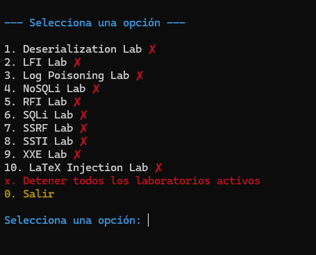

# insecure-labs

Repositorio de laboratorios vulnerables para la realización de mi Proyecto de Fin de Grado.

## 📌 Descripción
**insecure-labs** es un conjunto de entornos diseñados para el aprendizaje y la práctica de técnicas de seguridad ofensiva. Cada laboratorio simula una aplicación con vulnerabilidades específicas, permitiendo su explotación en un entorno controlado.

## 🚀 Tecnologías Utilizadas
- **Backend:** Flask (Python), PHP, Express (NodeJS)
- **Bases de Datos:** MySQL, MongoDB
- **Contenerización:** Docker & Docker Compose

## 🛠️ Instalación y Ejecución
### Requisitos Previos
- Docker y Docker Compose instalados en el sistema.

### Pasos para desplegar el entorno
```sh
# Clonar el repositorio
git clone https://github.com/tu-usuario/insecure-labs.git
cd insecure-labs
cd {nombre_laboratorio}

# Construir y ejecutar los contenedores
docker-compose up --build -d
```

### Forma alternativa

```sh
# Clonar el repositorio
git clone https://github.com/tu-usuario/insecure-labs.git
cd insecure-labs

# Ejecutar un script para gestionar los laboratorios
python deploy_labs.py
```



## ⚠️ Advertencia
Este proyecto es solo para **fines educativos y de investigación**. No se debe utilizar en entornos de producción ni para actividades malintencionadas.

