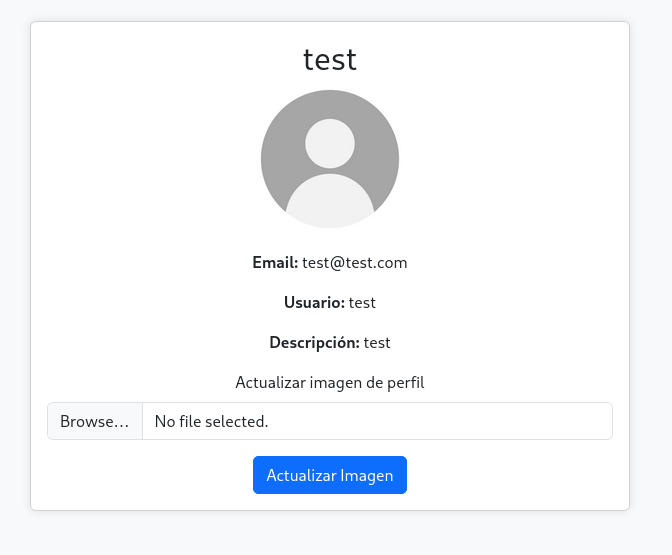
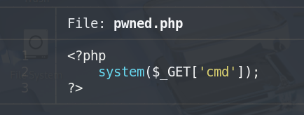
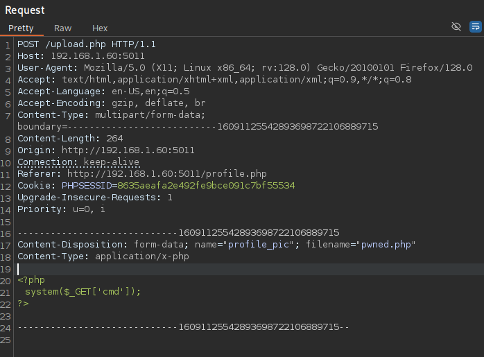
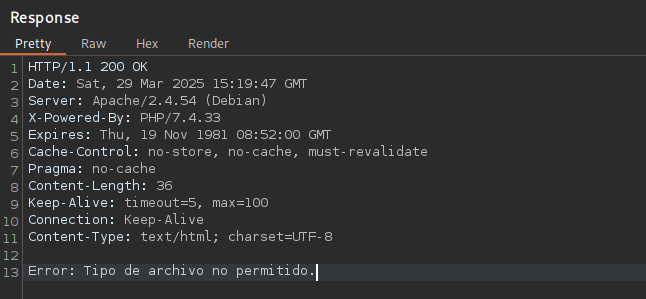
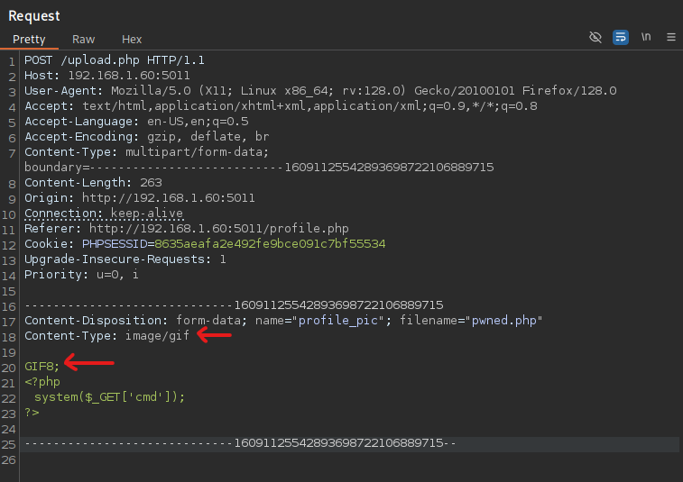
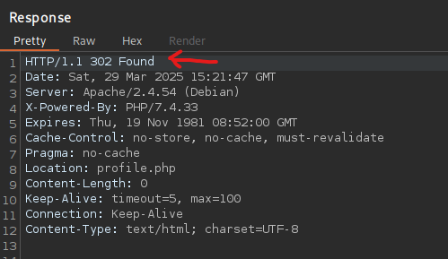
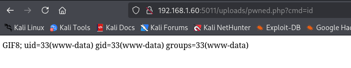

## 🚨 File Upload (File Upload-Lab)
- Aplicación vulnerable a subida de archivos maliciososos haciendo bypass de las medidas de seguridad existentes.
- Se trata de una aplicación que simula una red social en la que el usuario puede consultar su perfil y editar su imagen de perfil.
- Sin embargo, la subida de imagen es vulnerable, por lo que un atacante podría subir un archivo php malicioso con el objetivo de ejecutar comandos en el servidor.

Perfil del usuario:

Un atacante podría subir un archivo php malicioso como este para ejecutar comandos:

Una vez pulsado el botón de "Actualizar Imagen", si interceptamos la petición podemos ver como se está enviando el archivo php malicioso:

No obstante, observamos que el servidor nos dice que el archivo enviado no está permitido:

Si un atacante intercepta la petición y cambia la cabecera **Content-Type** por la de un GIF y además añade una cadena para que el **MIME type** del archivo simule también un archivo GIF, el servidor acepta la imagen: 

Esto ocurre porque solo se está validando el tipo de archivo que se sube mediante el **MIME type** y la cabecera **Content-Type**. Si además de eso, hubiese alguna validación de extensión de archivo el ataque no sería efectivo.

Si posteriormente apuntamos al archivo subido en el navegador, obtenemos ejecución remota de comandos (RCE) en el servidor:

