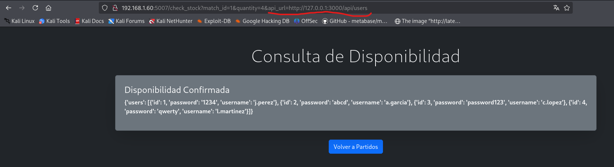

## 🚨 Server Side Request Forgery (SSRF-Lab)
- Aplicación vulnerable a Sever Side Request Forgery, en Español algo como "falsificación de solicitud del lado del servidor".
- Se trata de una aplicación web en la que se pueden consultar la cantidad de entradas disponibles para una serie de partidos de fútbol.
- Esta vulnerabilidad es crítica ya que el atacante puede llegar a ver información de servicios internos del servidor que no llegan a estar expuestos al exterior.

A la hora de hacer una consulta de la disponibilidad de una entrada para un partido de futbol, se envía un parámetro llamado "api_url" que contiene la url de la API a la que se llama para hacer la consulta de entradas.

Sin embargo, un usuario malintencionado podría cambiar la url por una local del servidor para descubrir información no expuesta desde el exterior.

En este ejemplo se muestra cómo un usuario puede descubrir información interna de una API no expuesta al tráfico exterior:

