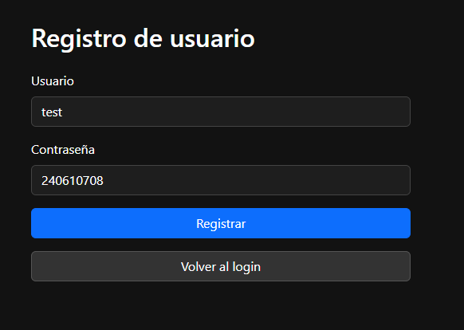
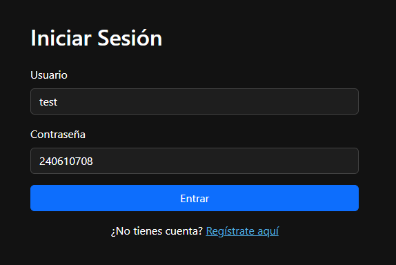
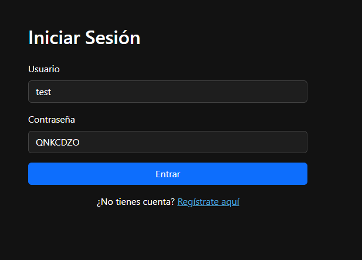
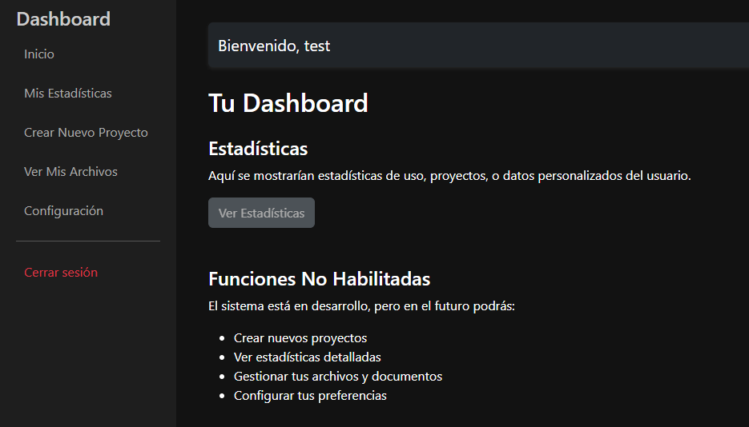

## 🚨 Type Juggling Attack (Type Juggling-Lab)
- Aplicación vulnerable a **type juggling attack**, una vulnerabilidad existente en varios lenguajes de programación al efectuar comparaciones de tipo "loose(==)".
- En este caso, se trata de un formulario vulnerable de inicio de sesión a un dashboard personal.
- En concreto, está desarrollado en lenguaje PHP y emplea comparaciones de igualdad débil, por lo que un usuario puede llegar a acceder al sistema sin proporcionar exactamente su contraseña.

En este caso, este tipo de ataque es factible gracias a los llamados "magic numbers":

Los magic numbers son valores que, al ser comparados usando el operador "==" en PHP, se evalúan como verdaderos a pesar de no coincidir exactamente con el valor esperado (en este caso, el hash MD5 de la contraseña). Esto sucede debido a cómo PHP convierte implícitamente los tipos de datos en las comparaciones "loose". Al enviar uno de estos magic numbers como la contraseña, el sistema considera que es válido, lo que permite acceder al sistema sin conocer la contraseña real.

Magic numbers para el ataque de Type Juggling (md5): [listado completo](https://github.com/swisskyrepo/PayloadsAllTheThings/blob/master/Type%20Juggling/README.md)

- 240610708
- QNKCDZO
- 0e1137126905
- 0e215962017

Cuando creamos un usuario con cualquiera de estas contraseñas (magic numbers), el hash resultante es del estilo  "0+e[0-9]+", y PHP al hacer la comparación de tipo "==" procesa ambos valores como "0", por lo que el inicio de sesión será correcto cuando no debería serlo. Ejemplo:

Y para ambos inicios el resultado es exitoso (sólo debería haberlo sido en el primer caso, puesto que era la contraseña correcta).

