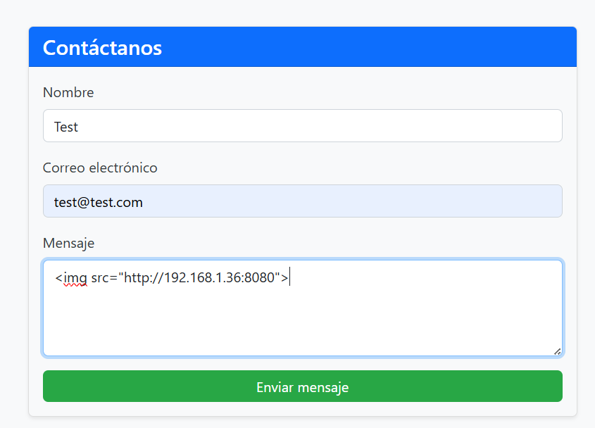
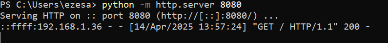
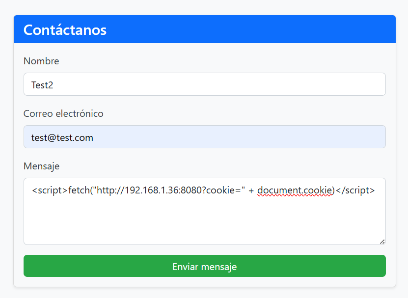
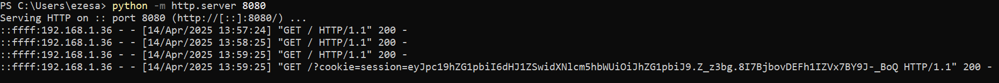
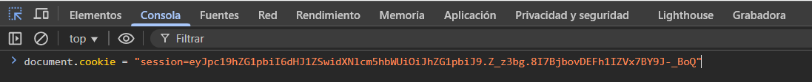
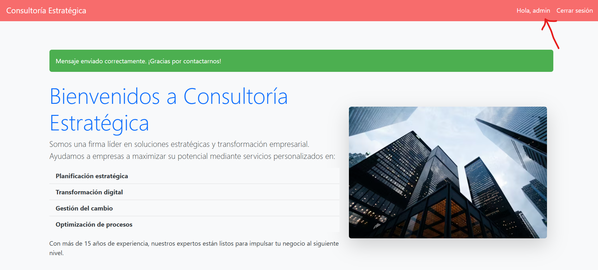
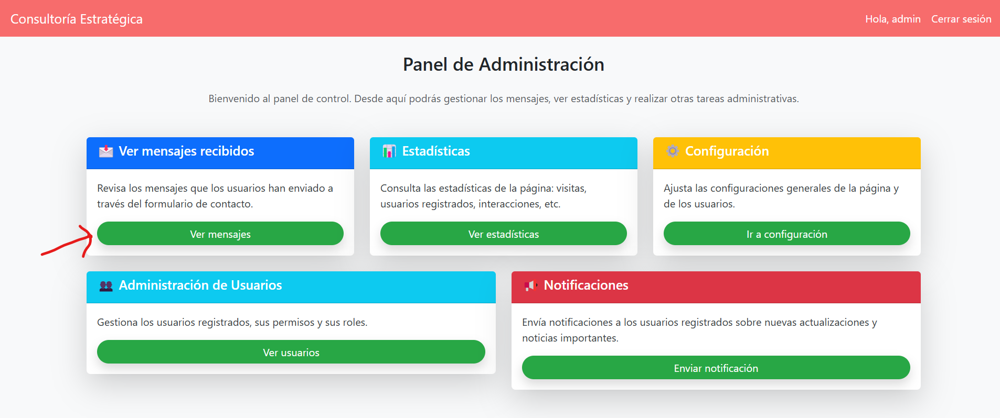
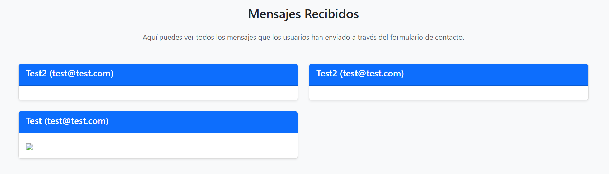

## 🚨 Cross-Site Scripting (XSS-Lab)
- Aplicación vulnerable a **Cross-Site Scripting (XSS)**, un tipo de ataque que permite a los atacantes inyectar un script malicioso en un sitio web para luego ser procesado y ejecutado con fines maliciosos.
- Normalmente, esto se debe a la confianza que tiene el sitio web sobre la entrada de datos (como por ejemplo en formularios).
- En concreto, este laboratorio contempla un sitio web que simula una empresa que ofrece servicios de consultoría. En ella hay un formulario (vulnerable) para que los clientes contacten con la empresa si les interesa algún servicio ofrecido.

El primer paso como atacante es probar si el formulario es vulnerable:

Para comprobarlo, nos montamos un servidor HTTP con python para estar a la escucha de posibles peticiones entrantes y finalmente recibimos la petición desde el servidor:

Es de vital importancia siempre sanitizar la entrada de los usuarios ya que en este caso, el usuario puede introducir un payload malicioso para hacer un **secuestro de sesión (cookie hijacking)**:

Como esto ha sido posible gracias a que un usuario ha revisado la sección de mensajes (de lo contrario no funcionaria), lo más probable es que haya sido revisada por un usuario administrador. A continuación, aplicamos la cookie obtenida en el navegador:

Una vez hecho esto, recargo la página y veo que estoy como administrador, luego el secuestro de sesión ha sido exitoso:

Panel de administración:

Página que revisaba continuamente el administrador a la espera de nuevos mensajes de contacto:

Es importante destacar que en este laboratorio se ha simulado que existe un administrador revisando los mensajes por detrás a través de un BOT con selenium. Básicamente está programado para que cada minuto acceda a la página de "Nuevos mensajes" y revise el nuevo contenido (como lo haría un usuario real en una web de estas características).